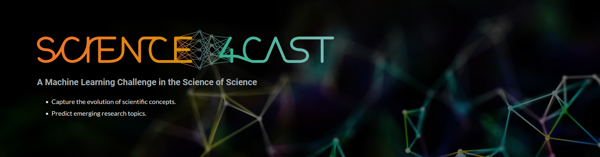
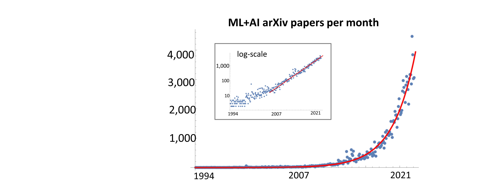
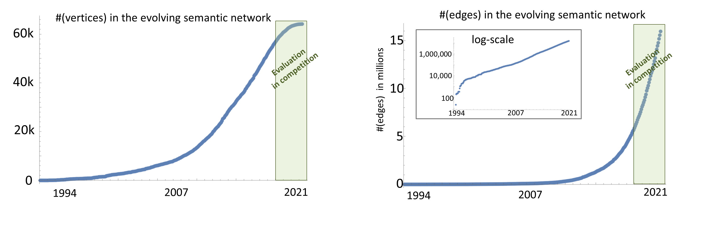
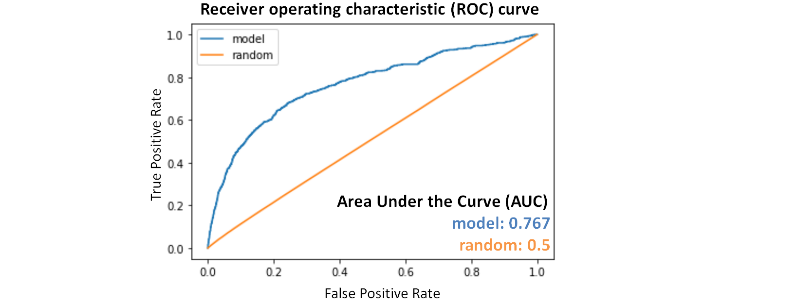
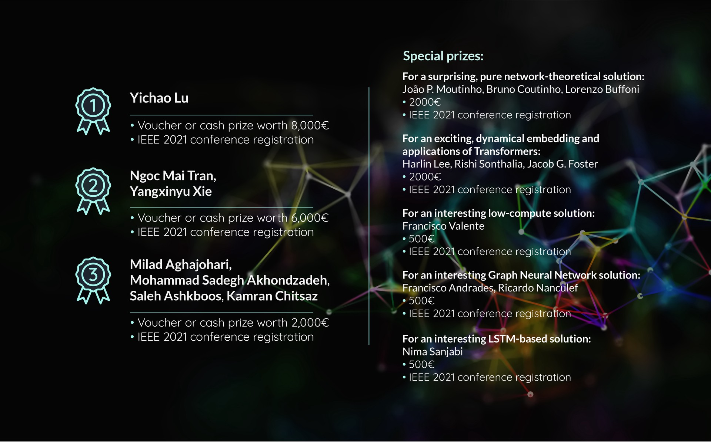

*Mario Krenn, Michael Kopp, David Kreil, Rose Yu, Moritz Neun, Christian Eichenberger, Markus Spanring, Henry Martin, Dirk Geschke, Daniel Springer, Pedro Herruzo, Marvin McCutchan, Alina Mihai, Toma Furdui, Gabi Fratica, Miriam Vázquez, Aleksandra Gruca, Johannes Brandstetter, Sepp Hochreiter*

**An official competition within the [2021 IEEE BigData Cup Challenges](http://bigdataieee.org/BigData2021/BigDataCupChallenges.html).**

1. [Introduction](#intro)
2. [The Task](#task)
3. [Files and Datasets](#ff)
4. [Winners](#winners)
5. [Submissions](#submit)
6. [Competition Timeline](#timeline)
7. [Questions, Suggestions, Issues](#questions)

## Updates
### 13.12.2021 - Workshop program
*17.12.2021 (CET times):*
* 16.00-16.10: Mario Krenn: [Short Intro](https://www.youtube.com/watch?v=0pcADmFkakA&list=PLG1x_3C3k_9ZRAG7U3IrxzqNeBH7Wm0VD)
* 16.10-16.40 (20+10): **1st Place:** Yichao Lu (Team oahciy): [*Predicting Research Trends in Artificial Intelligence with Gradient Boosting Decision Trees and Time-aware Graph Neural Networks*](https://www.youtube.com/watch?v=bAaFcMh7lm8&list=PLG1x_3C3k_9ZRAG7U3IrxzqNeBH7Wm0VD) [[arXiv](https://arxiv.org/abs/2201.05743)]
* 16.40-17.00 (13+ 7): **Special Prize (500EUR):** Francisco Valente (Team mondegoscroc): [*Link Prediction in Large-Scale Dynamic Network using Low Computational Power*](https://www.youtube.com/watch?v=SGV8OGZasKU&list=PLG1x_3C3k_9ZRAG7U3IrxzqNeBH7Wm0VD) [[arXiv](https://arxiv.org/abs/2202.03393)]
* 17.00-17.45 (35+10): **Invited Speaker - [Rose Yu](https://roseyu.com/):** [*Dynamics Learning with Graph Neural Networks*](https://www.youtube.com/watch?v=K31rtI2JCes&list=PLG1x_3C3k_9ZRAG7U3IrxzqNeBH7Wm0VD)

break
* 17.55+18.20 (15+10): **Special Prize (2000EUR):** Harlin Lee & Rishi Sonthalia (Team harlin): [*Dynamic Embedding-based Methods for Link
Prediction in Machine Learning Semantic Network*](https://www.youtube.com/watch?v=TkJliIuO5r0&list=PLG1x_3C3k_9ZRAG7U3IrxzqNeBH7Wm0VD)
* 18.20-18.45 (15+10): **2nd Place:** Ngoc Tran (Team Hash Brown): [*Random walk rankings with feature selection and imputation*](https://www.youtube.com/watch?v=J0TLeCox74k&list=PLG1x_3C3k_9ZRAG7U3IrxzqNeBH7Wm0VD) [[arXiv](https://arxiv.org/abs/2111.15635)]
* 18.45-19.05 (13+ 7): **Special Prize (500EUR):** Francisco Andrades (Team fandrades): [*A Method to Predict Semantic Relations on Artificial Intelligence Papers*](https://www.youtube.com/watch?v=Amx0dyFohzw&list=PLG1x_3C3k_9ZRAG7U3IrxzqNeBH7Wm0VD) [[arXiv](https://arxiv.org/abs/2201.10518)]
* 19.05-19.20 (13+ 7): **Special Prize (500EUR):** Nima Sanjabi (Team nimasanjabi): [*Efficiently Predicting Scientific Trends Using Node Centrality Measures*](https://www.youtube.com/watch?v=kOAzojnY83g&list=PLG1x_3C3k_9ZRAG7U3IrxzqNeBH7Wm0VD)

break
* 19.30-20.15 (35+10): **Invited Speaker: [Jacob Foster](https://soc.ucla.edu/faculty/jacob-foster):** [*Science and the social production of collective (un)intelligence*](https://www.youtube.com/watch?v=lql8ddXCxAE&list=PLG1x_3C3k_9ZRAG7U3IrxzqNeBH7Wm0VD)
* 20.15-20.40 (15+10): **Special Prize (2000EUR):** João Moutinho (Team joaopmoutinho): [*Network-based link prediction of scientific concepts*](https://www.youtube.com/watch?v=3b0nnpQG1mA&list=PLG1x_3C3k_9ZRAG7U3IrxzqNeBH7Wm0VD) [[arXiv](https://arxiv.org/abs/2201.07978)]
* 20.40-21.05 (15+10): **3rd Place:** Milad Aghajohari (Team SanatisFinests2): [*Degree-based Feature Is All You Need*](https://www.youtube.com/watch?v=ApRgxBlaXSY&list=PLG1x_3C3k_9ZRAG7U3IrxzqNeBH7Wm0VD)
* 21.05-21.15: Conclusion

### 02.12.2021 - annoucement of winners
Congratulations to all [winners](#winners)! All winners will join our **IEEE BigData 2021 Science4Cast Special Session**:

**17. December, 10.00-15.00 EST/16.00-21.00 CET.**

Please register or send an [e-Mail](mailto:mario.krenn@mpl.mpg.at) for additional information. All talks will be recorded and uploaded to youtube.

### 10.11.2021 - result submission deadline today AoE!
We extend the paper submission deadline by one week. Please submit your short scientific paper (3-6pages) by **24.November 2021** (updates on submission follow in the next few days). The paper should explain in detail your method and results. We will invite all participants (with non-trivial results) to participate to our dataset paper which is scheduled shortly after the competition workshop. Thus, your paper can be a first draft of your contribution to our dataset paper. Looking forward to your great results!

### 29.10.2021
We extend the deadline by one week - you can submit solutions until **10.November 2021**. Furthermore, we will **invite all participants to contribute to the dataset paper** (which will be written shortly after the competition ends, more details later.).

## 1. <a name="intro">Introduction</a>

The corpus of scientific literature grows at an ever-increasing speed. Specifically, in the field of Artificial Intelligence (AI) and Machine Learning (ML), the number of papers every month grows exponentially with a doubling rate of roughly 23 months. 

Consequently, researchers have to specialize in narrow subdisciplines, making it challenging to uncover scientific connections beyond their own area of research. A tool that could predict and suggest meaningful, personalized research ideas that transcend personal focus bubbles would open new avenues of research that would otherwise remain untravelled.

Our competition directly addresses this challenge: We created an evolving semantic network characterizing the content and evolution of the scientific literature in AI since 1994. The network contains 64,000 nodes, each representing an AI concept. The competition's goal is to predict future states of the exponentially growing semantic network to create models capturing the evolution of scientific concepts in the field.

Moreover, the compiled unique dataset will be instrumental in the pursuit of a wide range of exciting questions in the area of ML for Science of Science -- a recently established research field in the intersection of computational sociology, network science and big data science (see a recent [review](https://science.sciencemag.org/content/359/6379/eaao0185.abstract) and [book](https://www.dashunwang.com/book/the-science-of-science)), sometimes called [Metaknowledge research](https://science.sciencemag.org/content/359/6379/eaao0185.abstract). Those questions include end-to-end trained concept discovery, predictions of concept emergence, predictions of interdisciplinary interactions, and suggestions of personalized research ideas. Solutions to our current competition and the existence of this extensive dataset will set us on the way to answer these vital questions.

### Related tasks
Evolving knowledge networks like these are a common research topic in the [Science of Science](https://www.dashunwang.com/book/the-science-of-science). Specifically, related semantic networks have been built in other disciplines in the natural sciences. Examples involve [biochemistry](https://www.pnas.org/content/112/47/14569), where no machine learning has been applied, and [quantum physics](https://www.pnas.org/content/117/4/1910) with a much smaller semantic network (our network has 10 times more nodes and 50 times more edges and grows significantly faster). Our dataset provides an order of magnitude larger network.

### Useful References
1. [Santo Fortunato, Carl T. Bergstrom, Katy Börner, James A. Evans, Dirk Helbing, Staša Milojević, Alexander M. Petersen, Filippo Radicchi, Roberta Sinatra, Brian Uzzi, Alessandro Vespignani, Ludo Waltman, Dashun Wang, Albert-László Barabási, Science of Science, Science 359(6379), eaao0185 (2018).](https://science.sciencemag.org/content/359/6379/eaao0185.abstract)
2. [Dashun Wang,  Albert-László Barabási. The science of science. Cambridge University Press, 2021.](https://www.dashunwang.com/book/the-science-of-science)
3. [James A. Evans, Jacob G. Foster, Metaknowledge, Science, 331(6018), 721-725, (2011).](https://science.sciencemag.org/content/359/6379/eaao0185.abstract)
4. [Andrey Rzhetsky, Jacob G. Foster, Ian T. Foster, James A. Evans, PNAS 112(47) 14569-14574 (2015).](https://www.pnas.org/content/112/47/14569)
5. [Mario Krenn, Anton Zeilinger, Predicting research trends with semantic and neural networks with an application in quantum physics, PNAS 117(4) 1910-1916 (2020).](https://www.pnas.org/content/117/4/1910)

## 2. <a name="task">The Task</a>
The main competition consists of **predicting new links in the semantic network**. We provide the semantic network from 1994-2017, with a discretization of days (which represents the publication date of the underlying papers). 

Therefore, we provide approximately 8,400 snapshots of the growing semantic network - one snapshot for each day from the beginning of 1994 to the end of 2017, and participants are welcome to use more coarse-grained snapshots. The evolution shows how the links between 64,000 nodes are drawn. The precise goal of the task is to predict the future links formed between 2017-2020 in the semantic network, which do not exist yet in 2017. _Equivalently, this task asks for the prediction of which scientific pairs of concepts will be investigated by scientists over three years._

### Technical Formulation of the Task

In the competition you get
- full_dynamic_graph_sparse: a dynamic graph (list of edges and their creation date) until a time t1.
- unconnected_vertex_pairs: a list of 1,000,000 vertex pairs that are unconnected by time t1.

**Your task in the competition** is to predict which edges of unconnected_vertex_pairs will form until a time t2. Specifically, you sort the list of potential edges in unconnected_vertex_pairs from most likely to most unlikely. The result will be computed via the AUC of the ROC curve. See more details in the [tutorial](Tutorial/tutorial.ipynb).

### The Evaluation Metric
For the evaluation, we use a subset of all 57,000 vertices with a nonzero degree per the end of 2017. We define the set K of vertex pairs that are not connected yet by an edge at the end of 2017 (in the extreme case, K contains roughly 3.2 billion vertex pairs, i.e. possible edges. In our case, K contains half a million vertex pairs). Every k in K will either be connected or not connected by 2020. The goal is to predict whether the two vertices will be connected or not. 

For evaluating the model, we use the **[ROC curve](https://en.wikipedia.org/wiki/Receiver_operating_characteristic)**. The ROC curve is created by plotting the true positive rate (TPR) against the false positive rate at various threshold settings. Our evaluation metric is the commonly used metric Area under the Curve (AUC) of the ROC curve. One advantage of AUC over mean-square-error (MSE) is its _independence_ of the data distribution. Specifically, in our case, where the two classes are highly asymmetrically distributed (with only about 1-3% of newly connected edges), and the distribution changing over time, the AUC provides a meaningful and operational interpretation. For perfect predictions, AUC=1, while random predictions give AUC=0.5. Operationally, it gives the percentage that a random true element is higher ranked than a random false one. 

We provide a baseline that is trained on the mean-square-error of the predictions and evaluated on AUC. The participants will provide a sorted list of all elements in K, which maximizes the AUC. A simple solution could sort the elements by the model's probability of an edge formation. We note explicitly that other ways of training are allowed and appreciated, for instance, by exploiting direct end-to-end training on the AUC metric.

## 3. <a name="ff">Files and Datasets</a>

**Source files: [/Competition/](/Competition)**
- Evaluate_Model.py: Evaluating the models
- SimpleModelFull.py: Baseline model

**Detailed tutorial: [/Tutorial/tutorial.ipynb](Tutorial/tutorial.ipynb)**
- How to read and visualize data
- How to run a baseline model
- How to create predictions for validation and competition data

**data files at [IARAI website](https://cloud.iarai.ac.at/index.php/s/iTx3bXgMdwsngPn):**
Science4Cast_data.zip contains the following three files:
- TrainSet2014_3.pkl: Semantic network until 2014, for predicting 2017
- TrainSet2014_3_solution.pkl: which edges are connected in 2017
- CompetitionSet2017_3.pkl: Semantic network until 2017, used for evaluation

*Copy those date files directly into the directory of the source files and tutorial.*

## 4. <a name="winners">Winners</a>

- **1st prize**: Yichao Lu (Layer 6 AI, Toronto): 8000Euro
- **2nd prize**: Ngoc Mai Tran and Yangxinyu Xie, (University of Texas at Austin): 6000Euro
- **3rd prize**: Milad Aghajohari (University of Montreal & MILA), Mohammad Sadegh Akhondzadeh (Saarland University & CISPA Helmholtz), Saleh Ashkboos (ETH Zurich), Kamran Chitsaz (Polytechnique Montreal)

### Special Prizes:
- *For a surprising, pure network-theoretical solution:* João P. Moutinho, Bruno Coutinho, Lorenzo Buffoni (Instituto de Telecomunicacoes Lisbon): 2000Euro
- *For an exciting, dynamical embedding and applications of Transformers:* Harlin Lee, Rishi Sonthalia, Jacob G. Foster (UCLA): 2000Euro
- *For an interesting low-compute solution:* Francisco Valente, Leiria, Portugal: 500Euro
- *For an interesting Graph Neural Network solution:* Francisco Andrades, Ricardo Nanculef (Federico Santa Maria Technical University Santiago, Chile): 500Euro
- *For an interesting LSTM-based solution:* Nima Sanjabi: 500Euro

In addition, all winners are invited to present their results at the IEEE Big Data Special Session, 17. December, 11.00-15.00 EST/17.00-21.00 CET.

## 5. <a name="submit">Submissions</a>
Participants can upload their predictions on the test dataset (*CompetitionSet2017_3.pkl*) to the leaderboard of the competitions until the submission deadline at the [IARAI website](https://www.iarai.ac.at/science4cast/). The file format is JSON, see details in the [tutorial](Tutorial/tutorial.ipynb)

Besides the submissions to the leaderboard (find it at the [IARAI website](https://www.iarai.ac.at/science4cast/)), submission of working code, learned parameters, and a short scientific paper (3-6 pages) to be published in the IEEE BigData workshop with a sufficiently detailed description of the approach used is required to be awarded a prize. The scientific quality of the submitted paper will be verified by the competition committee. 

After the competition, we plan to write a perspective/summary paper and invite all participants to contribute.

## 6. <a name="timeline">Competition Timeline</a>
All times and dates are Anywhere on Earth (UTC -12).

- Data Release: 25. August 2021
- Competition ends (submission deadline): 10. November 2021
- Short Scientific Paper (3-6 pages) submission deadline: 24. November 2021
- Announcement of the winners: 2. December 2021
- **IEEE BigData 2021 Science4Cast Special Session: 17. December, 11.00-15.00 EST/17.00-21.00 CET**

## 7. <a name="questions">Questions, Suggestions, Issues</a>
Please raise an GitHub issue if you have questions or problems, or send an e-Mail to [Mario Krenn](mailto:mario.krenn@mpl.mpg.at).
